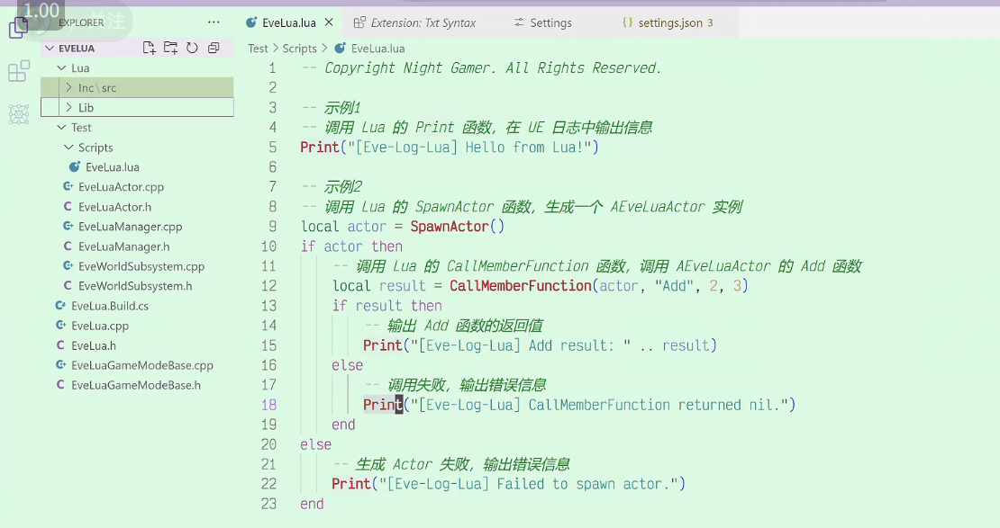

# 【UE5 C++】腾讯Unlua青春版 自己实现 一个工程搞懂反射

## 项目简介

本仓库对应B站视频[【UE5 C++】腾讯Unlua青春版 自己实现 一个工程搞懂反射](https://www.bilibili.com/video/BV1XRX7YCEMG/?spm_id_from=333.788.videopod.sections&vd_source=ab67845b846f1632f14b7e2c4a6c5935)的完整实现工程。旨在通过最小化工程的形式，帮助开发者理解从UE5 C++反射到Lua的底层原理，掌握如何自己实现类似腾讯Unlua的工具，而非直接使用现有方案，助力开发者深入理解UE5反射机制及C++与Lua的交互逻辑。

## 核心内容

视频及配套工程主要围绕以下方面展开：

1. **原理解析**
   深入讲解UE5 C++反射到Lua的核心原理，说明为何不直接使用腾讯Unlua等现有方案，而是通过自建最小工程来理解其本质，同时阐述反射到Lua与反射到蓝图的相似性。

2. **功能实现**
   提供完整可运行的代码示例，实现从Lua到UE5 C++的通路打通，包括：

- 在Lua中实现打印功能，并传递到UE5 C++中执行
- 在Lua中生成Actor，并调用该Actor的成员函数
- 关键函数（如print、spawn_actor、call_member_function）的底层实现逻辑，涉及LUA状态机构建、函数重定向、反射知识应用、LUA栈操作等

3. **代码结构**
   展示工程的核心文件及功能，包括：

- LuaManager：负责LUA状态机初始化、函数重定向、LUA脚本执行等关键操作
- 演示用Actor：包含简单成员函数，用于验证Lua调用C++函数的效果
- 相关配置：静态库的部署、库和头文件的处理等

## 工程获取与使用

1. **环境要求**

- Unreal Engine 5.0+
- Visual Studio 2022（或 Rider 2024）
- VS Code（用于查看工程文件）

2. **下载地址**

- 完整工程：[获取链接](https://github.com/AstroWYH)

3. **快速启动**
   获取工程后，用VS Code打开工程，确保部署好相关库和头文件，右键`.uproject`文件选择对应引擎版本，生成项目所需文件，运行后可通过日志查看Lua调用UE5 C++功能的执行效果。

## 适用人群

- 游戏公司开发人员，无论C++或C#开发者，需接触Lua脚本语言者
- 希望深入理解UE5反射机制的开发者
- 对腾讯Unlua等Lua方案底层实现感兴趣的学习者
- 准备应聘游戏公司UE5开发岗位，需掌握C++与Lua交互的求职者

## 相关资源

- 视频链接：[【UE5 C++】腾讯Unlua青春版 自己实现 一个工程搞懂反射](https://www.bilibili.com/video/BV1...[完整视频链接])
- 系列教程：查看作者其他UE5 C++教程（背包系统、网络同步、Mass框架等）
- 参考项目：作者推荐的UE5相关学习项目（如GAS:Lyra、Aura等）

## 作者信息

前华为/百度程序员，专注分享UE5 C++游戏开发实战知识。

- 更多工程与源码：[个人仓库](https://github.com/AstroWYH)
- B站主页：[晚上做游戏](https://space.bilibili.com/89037636?spm_id_from=333.1007.0.0)

## 许可证

本工程基于MIT许可证开源，允许个人与商业项目自由使用、修改和分发，如需二次发布请注明原作者及视频来源。
